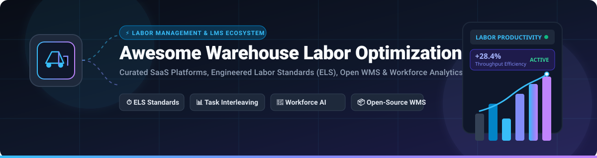

<p align="center">
  
</p>

# 📦 Awesome Warehouse Labor Optimization

<p align="center">
  <a href="https://github.com/ishandutta2007/Awesome-Awesome-Awesome"></a>
  <a href="https://discord.gg/jc4xtF58Ve"></a>
  
  
  
  <a href="https://github.com/ishandutta2007"></a>
</p>

---

## 🌐 Overview & Ecosystem Guide
**Curated List of SaaS Products & Open-Source GitHub Projects for Warehouse Labor Optimization**  
*Focused on Labor Management Systems (LMS), Engineered Labor Standards (ELS), Associate Productivity Tracking, Workforce Planning, Task Interleaving, Pick-Path Optimization & Logistics Analytics*  
**Last updated: August 2026**

This repository tracks the premier **SaaS platforms** and **open-source repositories** designed for **Warehouse Labor Optimization**. In modern distribution centers, fulfillment facilities, and 3PL operations, labor accounts for 50–70% of total warehousing operational expenditures. These platforms measure and improve workforce performance through **Engineered Labor Standards (ELS)**, real-time activity tracking, automated shift rostering, incentive management, task interleaving, and direct integration with Warehouse Management Systems (WMS) and Warehouse Execution Systems (WES).

---

## 📑 Table of Contents
- [🏢 SaaS & Hosted Platforms](#-saas--hosted-platforms)
- [💻 Open-Source GitHub Projects](#-open-source-github-projects)
- [🏗️ Architecture & Implementation Patterns](#️-architecture--implementation-patterns)
- [🤝 How to Contribute](#-how-to-contribute)
- [📈 Star History](#-star-history)
- [⚠️ Disclaimer](#️-disclaimer)

---

## 🏢 SaaS & Hosted Platforms

> Sorted by **Company Size / Valuation / Revenue** in descending order.

| Platform | Company Size (Valuation / Revenue) | Core Capabilities | Starting Pricing | Free Tier / Free Trial Limits |
| :--- | :--- | :--- | :--- | :--- |
| **[Manhattan Associates / Manhattan Active Labor Management](https://www.manh.com/)** | **~$11.5B** Market Cap (NASDAQ: MANH) / ~$1.08B Annual Revenue | Cloud-native labor planning, continuous engineered standards, gamification, and task optimization integrated with Manhattan Active WMS/SCE. | Starting at ~$10,000/month (~$120,000/year base tier) scaled by associate headcount and annual facility order volume | 14-to-30-day structured virtual test environment / POC during sales qualification (scoped to simulated facility flows; no permanent free plan) |
| **[Blue Yonder Warehouse Labor Management](https://blueyonder.com/)** | **$8.5B** Valuation (Acquired by Panasonic) / ~$1.1B+ Annual Revenue | Enterprise-grade labor management (formerly JDA LMS) with multi-variable engineered labor standards (ELS), shift forecasting, and incentive pay management. | Starting at ~$8,333/month (~$100,000/year entry enterprise license) plus implementation services | 30-day guided interactive sandbox / POC evaluation for qualified enterprise accounts (restricted to test environments; no permanent free plan) |
| **[Körber](https://www.koerber-supplychain.com/)** | **€3.1B (~$3.4B)** Parent Group Revenue (Körber AG) / 13,000+ employees | K.Motion Labor Management System (LMS) & WMS suite with labor standards calculation, employee scorecards, and warehouse execution monitoring. | Starting at ~$2,500/month (~$30,000/year base SaaS subscription for mid-market distribution centers) | 30-day guided sandbox pilot deployment (limited to single facility workflow modeling; no permanent free plan) |
| **[Infios](https://www.infios.com/)** | **Enterprise Scale** (KKR & Körber AG Joint Venture; 5,000+ global customer deployments) | End-to-end execution suite (OMS/WMS/TMS) that incorporates labor management and workforce tracking within broader warehouse and fulfillment workflows. | Starting at ~$3,500/month (~$42,000/year entry tier) scaled based on facility count and transaction volume | 30-day structured proof-of-concept / sandbox evaluation (limited to staging environment; no permanent free plan) |
| **[Made4net](https://www.made4net.com/)** | **~$100M+** Valuation Scale (Acquired by Ingka Group / IKEA parent; ~$30M+ est. revenue) | WarehouseExpert & LaborExpert supply chain suite featuring dynamic labor standards, task allocation, and real-time worker productivity dashboards. | Starting at ~$500/month (or ~$15,000/year entry software subscription for mid-tier warehouses) | 14-day assisted demo sandbox / interactive POC (limited to pre-configured test dataset; no permanent free plan) |
| **[Extensiv](https://www.extensiv.com/)** | **~$55M–$90M** Est. Valuation ($80M–$146M total funding; ~$20M–$28M annual revenue) | 3PL Warehouse Manager and Integration Manager offering labor tracking, billing automation, and fulfillment operational metrics. | Starting at $39/month for Integration Manager; $599/month starting tier for 3PL Warehouse Manager | 30-day free trial on Integration Manager (1st month free, capped at 100 orders/month); 14-day guided sandbox for 3PL Warehouse Manager |
| **[Logiwa](https://www.logiwa.com/)** | **~$50M–$80M** Est. Valuation ($38.9M total funding; ~$28M–$46M annual revenue) | High-volume ecommerce & 3PL cloud WMS featuring labor productivity analytics, task interleaving, and pick/pack rate tracking. | Starting at ~$500/month base tier (volume-tiered by monthly order throughput) | 14-day guided test sandbox environment (capped at 500 test orders & demo SKU catalog; no permanent free plan) |
| **[Easy Metrics](https://www.easymetrics.com/)** | **~$40M–$60M** Est. Valuation ($38.5M total funding incl. $31M Nexa Equity growth round; ~$10M–$15M revenue) | Cloud-based labor performance & cost-to-serve analytics connecting warehouse activity data with productivity standards, costing, and 3PL billing insights. | Starting at ~$1,500/month base SaaS tier (~$15–$30/active employee/month; fraction of traditional $250k+ on-prem LMS) | 14-day guided proof-of-concept (POC) sandbox trial (limited to sample shift dataset & single facility evaluation; no permanent free plan) |
| **[Lucas Systems](https://www.lucasware.com/)** | **~$15M–$25M** Est. Annual Revenue (Privately held, profitable mid-market leader) | Voice-directed execution (Jennifer™), AI dynamic work optimization, pick-path routing, and real-time associate labor tracking. | Starting at ~$2,500/month base SaaS tier (or ~$25,000 upfront facility deployment based on voice client license packs) | 30-day proof-of-value (POV) pilot program for qualified enterprise facilities (hands-on workflow evaluation; no permanent free plan) |
| **[Hopstack](https://www.hopstack.io/)** | **~$7.6M** Est. Valuation ($2.82M seed funding / ~$2.5M ARR) | Modern digital WMS platform with native labor productivity insights, real-time task management, and pick/pack workstation optimization. | Starting at $199/month (Ignite / Starter tier up to 50,000 units/month; Growth tier at $249/month up to 100,000 units/month) | 30-day free trial (full access to Hopstack Ignite features up to 5,000 test orders; no permanent free plan) |

---

## 💻 Open-Source GitHub Projects

> Sorted by **GitHub Star Counts** in descending order. Star badges link directly to each repository's stargazers.

- **[frappe/erpnext](https://github.com/frappe/erpnext)** [](https://github.com/frappe/erpnext/stargazers)  
  Full-featured open-source ERP system with comprehensive warehouse management, bin locations, batch/serial tracking, pick lists, material requests, and integrated HR workforce capacity planning.

- **[snipe/snipe-it](https://github.com/snipe/snipe-it)** [](https://github.com/snipe/snipe-it/stargazers)  
  Open-source asset and inventory management system with robust QR/barcode tracking, check-in/check-out audit trails, location management, and associate activity logging.

- **[google/or-tools](https://github.com/google/or-tools)** [](https://github.com/google/or-tools/stargazers)  
  Fast, open-source combinatorial optimization suite from Google, widely used for warehouse pick-path routing, vehicle routing problems (VRP), workforce shift scheduling, bin packing, and task assignment.

- **[frappe/hrms](https://github.com/frappe/hrms)** [](https://github.com/frappe/hrms/stargazers)  
  Modern open-source HR and workforce management system providing shift planning, attendance tracking, shift assignments, biometric integration, and labor capacity analytics for warehouse teams.

- **[inventree/InvenTree](https://github.com/inventree/InvenTree)** [](https://github.com/inventree/InvenTree/stargazers)  
  Python and Django-based open-source inventory and warehouse tracking system with modular architecture, barcode scanning, location management, and worker task tracking.

- **[GreaterWMS](https://github.com/GreaterWMS/GreaterWMS)** [](https://github.com/GreaterWMS/GreaterWMS/stargazers)  
  Fully open-source warehouse management system supporting multiple clients (iOS, Android, Web, PC) with inventory, inbound/outbound routing, scanning, and operational labor tracking.

- **[TimefoldAI/timefold-solver](https://github.com/TimefoldAI/timefold-solver)** [](https://github.com/TimefoldAI/timefold-solver/stargazers)  
  Open-source AI constraint satisfaction solver (forked from OptaPlanner) for automated warehouse shift rostering, employee scheduling, task interleaving, and labor capacity optimization.

- **[partkeepr/PartKeepr](https://github.com/partkeepr/PartKeepr)** [](https://github.com/partkeepr/PartKeepr/stargazers)  
  Open-source inventory management software tailored for tracking electronic components, warehouse storage bins, stock movements, and batch handling.

- **[openwms/org.openwms](https://github.com/openwms/org.openwms)** [](https://github.com/openwms/org.openwms/stargazers)  
  Modular, microservices-based open-source Warehouse Management System (WMS) and Transport Management System (TMS) built with Spring Boot for manual and automated logistics flows.

- **[OCA/wms](https://github.com/OCA/wms)** [](https://github.com/OCA/wms/stargazers)  
  Odoo Community Association warehouse management modules covering advanced logistics, wave picking, shopfloor operations, release channels, and task-oriented labor workflows.

- **[rodrigo-arenas/pyworkforce](https://github.com/rodrigo-arenas/pyworkforce)** [](https://github.com/rodrigo-arenas/pyworkforce/stargazers)  
  Open-source Python library for workforce planning and operational research, including Erlang queuing models, labor shift scheduling, rostering, and warehouse staffing optimization.

---

### ➕ Additional Strong Open-Source Building Blocks
- **⏱️ Time & Attendance Tracking**: Integration of open-source time-tracking engines with WMS event streams for active pick/put cycle measurement.
- **🗺️ Pick-Path Optimization**: Graph algorithms and TSP solvers (via `NetworkX` or `OR-Tools`) to reduce associate deadhead travel by 20–40%.
- **📱 Shopfloor & Barcode Scanning**: Web/mobile scanning interfaces feeding real-time worker task timestamps into analytics pipelines.
- **📊 Self-Hosted KPI Dashboards**: Modern BI tools (**Metabase**, **Apache Superset**, **Grafana**) connected to WMS transaction databases for real-time productivity scorecards.

---

## 🏗️ Architecture & Implementation Patterns

```
                                  +---------------------------------------+
                                  |    WMS / ERP Execution Transactions   |
                                  | (Receiving, Putaway, Picking, Pack)   |
                                  +-------------------+-------------------+
                                                      |
                                                      v
                                  +---------------------------------------+
                                  |      Activity & Event Stream Layer    |
                                  |    (Timestamps, Locations, Units)     |
                                  +-------------------+-------------------+
                                                      |
                                                      v
                                  +---------------------------------------+
                                  |    Engineered Labor Standards (ELS)   |
                                  |   (Variable Speeds, Weight, Travel)   |
                                  +-------------------+-------------------+
                                                      |
                         +----------------------------+----------------------------+
                         |                                                         |
                         v                                                         v
    +-----------------------------------------+               +-----------------------------------------+
    |       Real-Time Worker Productivity     |               |        Workforce Shift Scheduling       |
    |  - Individual & Shift Scorecards        |               |  - Capacity & Demand Forecasting        |
    |  - Performance vs. 100% Base Standard   |               |  - Roster Optimization & Task Balancing |
    |  - Incentive & Bonus Tier Calculation   |               |  - Dynamic Task Interleaving & Routing  |
    +-----------------------------------------+               +-----------------------------------------+
```

**Framework for Custom Labor Optimization Stacks**:
1. **Core WMS Platform**: Deploy an extensible open-source core (**ERPNext**, **GreaterWMS**, **OpenWMS**, or **InvenTree**).
2. **Event Capture**: Log discrete task timestamps (travel start, scan start, scan complete, confirm).
3. **Standards Engine**: Apply multi-variable engineered standards using Python libraries like **pyworkforce** or **OR-Tools**.
4. **Optimization Layer**: Automate shift rostering and task assignment using **Timefold Solver / OptaPlanner**.
5. **Observability**: Stream performance metrics to **Metabase** or **Grafana** for associate, team, and facility-level visibility.

---

## 🤝 How to Contribute
1. 🍴 Fork the repository.
2. 📝 Add or edit entries in `README.md` (ensure adherence to the existing tabular and badge formats).
3. 🔗 Include: name, official link, 1–2 sentence description, pricing/limits (for SaaS), or repo link (for OSS).
4. 🚀 Submit a Pull Request with a clear summary of your additions.

⭐ **Star the repo if you find it helpful!**

---

## 📈 Star History
[](https://star-history.dera.page/#ishandutta2007/Awesome-Warehouse-Labor-Optimization&type=date&legend=top-left)

---

## ⚠️ Disclaimer
- This is a **community-curated** directory provided for informational and educational purposes — not an endorsement of any vendor or project.
- Warehouse labor systems handle sensitive employee productivity data. Always ensure compliance with local labor legislation, data privacy standards (GDPR, CCPA), and collective bargaining agreements.
- Open-source implementations require rigorous customization, integration, and operational engineering to achieve parity with dedicated commercial LMS suites.

---

<p align="center">
  <b>Built for Warehouse Operations Leaders, 3PL Executives, Industrial Engineers, and Supply Chain Technologists.</b><br/>
  <i>Let's make warehouse labor management more efficient, transparent, and fair.</i>
</p>
